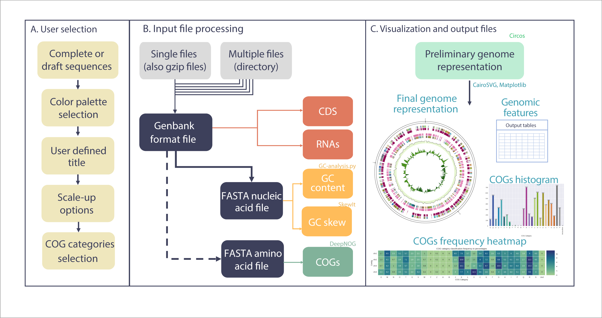

# GenoVi: Genome Visualiser Software

**GenoVi** generates circular genome representations for complete or draft bacterial and archaeal genomes. **GenoVi** pipeline combines several python scripts to automatically generate all needed files for Circos, including customisable options for colour palettes, fonts, font format, background colour and scaling options for complete or draft genomes comprising more than 1 replicon. Optionally, **GenoVi** built-in workflow integrates DeepNOG to annotate COG categories using alignment-free methods with user-defined thresholds.



## Installation

GenoVi dependencies can be installed creating the following bioconda environment

```
conda create -n genovi python=3.7 circos 
```
Activate the environment
```
conda activate genovi
```
GenoVi can then be installed using pip

```
pip install genovi
```
 
## Dependencies
* [Circos 0.69-8](http://www.circos.ca/software/ "Circos")
* Python 3.7 or later
* [DeepNog 1.2.3](https://github.com/univieCUBE/deepnog "DeepNOG")
* NumPy 1.20.2
* MatPlotLib 3.5.2
* Pandas 1.2.4
* Biopython 1.79
* CairoSVG 2.5.2
* Perl 5
* List::MoreUtils (Perl library)

## Usage <a name="usage"></a>


```
genovi [-h] [options ..] -i input_file -s status
```

### Main arguments
* `-i`, `--input_file`. GenBank input file path.
* `-o`, `--output_file`.  Output file name. Default: circos.
* `-s`, `--status`. “complete” or “draft”. Complete genomes are drawn as separate circles for each contig/replicon.

### Information:
* `-h`, `--help`. Shows this help message and exit.
* `--version`. Shows the currently installed version of genovi.

### COGs:
* `-cu`, `--cogs`_unclassified. Do not classify each coding sequence into Clusters of Orthologous Groups of proteins (COGs).
* `-b`, `--deepnog`_confidence_threshold. DeepNOG confidence threshold range \[0,1\] Default: 0. If provided, predictions below the threshold are discarded.

### Format:
* `-a`, `--alignment`. When a `--status complete` is specified, this flag defines the alignment of each individual contig. Options: `center`, `top`, `bottom`, `A` (First on top), `<` (first to the left), `U` (Two on top, the rest below). By default this is defined by contig sizes.
* `--scale`. When using `--status complete`, whether to use a different scale format to ensure visibility. Options: `variable`, `linear`, `sqrt`. Default: `sqrt`.
* `-k`, `--keep_temporary_files`. Keep temporary files.
* `-w`, `--window`. Window size (base pair) to assign a GC analysis. Default: `5000`.
* `-v`, `--verbose`. Verbose or in console log messages activated.

### Text:
* `-c`, `--captions_not_included`.  Do not include captions in the figure.
* `-cp`, `--captions_position`. Captions position. Options: `left`, `right`, `auto`.
* `-t`, `--title`. Figure title.
* `--title_position`. Title position. Options: `center`, `top`, `bottom`.
* `--italic_words`. How many title words should be written in italic. Default: `2`.
* `--size`. Display genome size of each independent circular representation.

### Colours:
* `-cs`, `--colour_scheme`. Prebuilt colour scheme to use for CDS, RNAs and GC analysis. Options: `neutral`, `blue`, `purple`, `soil`, `grayscale`, `velvet`, `pastel`, `ocean`, `wood`, `beach`, `desert`, `ice`, `island`, `forest`, `toxic`, `fire`, `spring`.
* `-bc`, `--background`. Background colour, in R, G, B format. Default: `transparent`.
* `-fc`, `--font_colour`. Font colour. Default: `black`.
* `-pc`, `--CDS_positive_colour`. Colour for positive CDSs, in R, G, B format. Default: `'180, 205, 222'`.
* `-nc`, `--CDS_negative_colour`. Colour for negative CDSs, in R, G, B format. Default: `'53, 176, 42'`.
* `-tc`, `--tRNA_colour`. Colour for tRNAs, in R, G, B format. Default: `'150, 5, 50'`.
* `-rc`, `--rRNA_colour`. Colour for rRNAs, in R, G, B format. Default: `'150, 150, 50'`.
* `-cc`, `--GC_content_colour`. Colour for GC content, in R, G, B format. Default: `'23, 0, 115'`.
* `-sc`, `--GC_skew_colour`. Colour scheme for positive and negative GC skew. A pair of RGB colours. Default: `'140, 150, 198 - 158, 188, 218'`.
* `-sl`, `--GC_skew_line_colour`. Colour for GC skew line. Default: `black`.

More detailed information about the arguments can be found in the [user guide](https://github.com/robotoD/GenoVi/wiki/User-guide#arguments-).

## Tutorials

Check the tutorials in the [user guide tutorials](https://github.com/robotoD/GenoVi/wiki/User-guide#tutorials-).

## Output files  
Resulting images are saved in a folder called **\[name\]** as **\[name\].svg** and **\[name\].png** (name being specified with `output_file` argument or, by default, circos. In case of a complete genome, individual contig image files are stored in a **\[name\]** subdirectory as **\[name\]-contig_\[i\].png** with i in \[1, the number of circles\].

Besides images, if `-k` or `--keep_temporary_files` was called, files described in [user guide arguments](https://github.com/robotoD/GenoVi/wiki/User-guide#keep-temporary-files-) will also be stored. 

Three additional files are stored in **\[name\]** folder: a histogram displaying COG categories named **\[name\]_COG_histogram.png**; a file with the COG classification of each replicon named **\[name\]_COG_Classification.csv**; and a csv file named **\[name\]_Gral_Stats.csv** displaying general information of each replicon, including size, GC content, number of CDS, tRNA and rRNA.

## Additional information
For further information, please read the [user guide](https://github.com/robotoD/GenoVi/wiki/User-guide).

## Publication

WIP

## Citation and License

GenoVi is under a BY-NC-SA Creative Commons License, Please cite.
Cumsille et al., 2022 

You may remix, tweak, and build upon this work even for commercial purposes, as long as you credit this work and license your new creations under the identical terms. 
