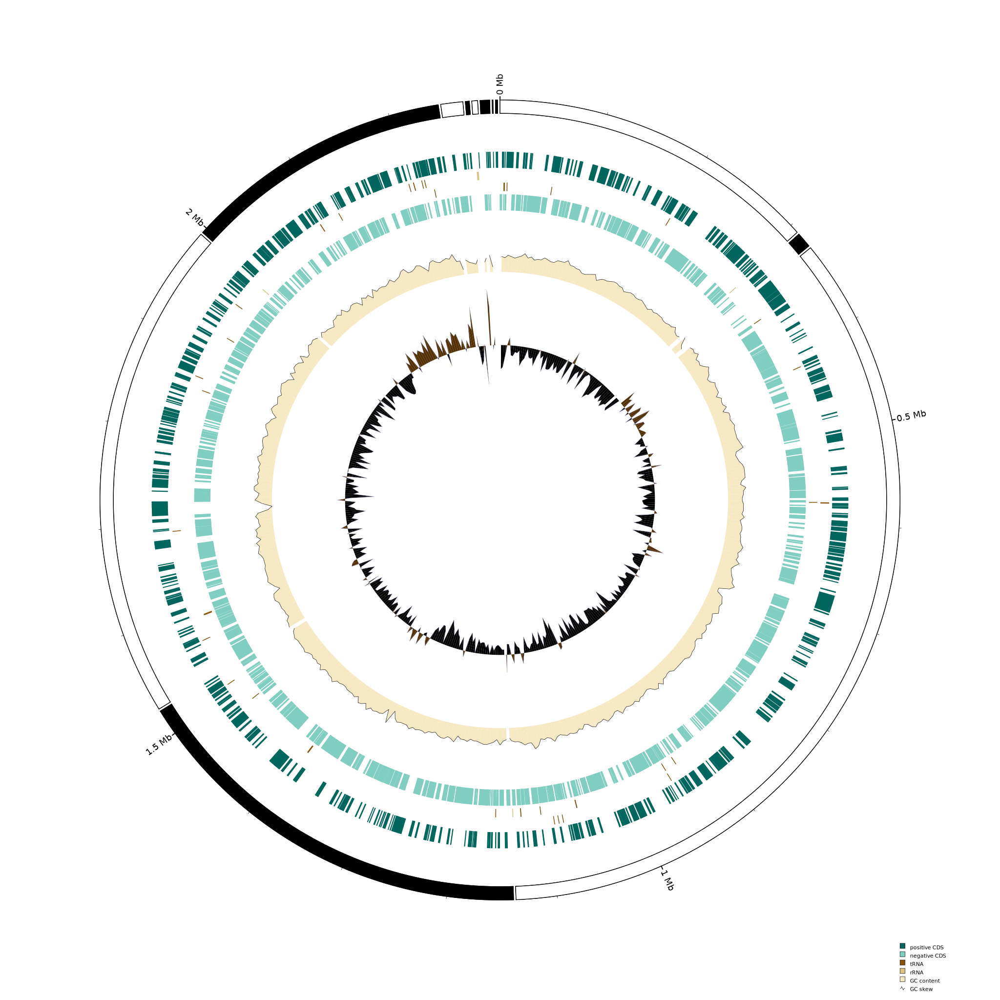
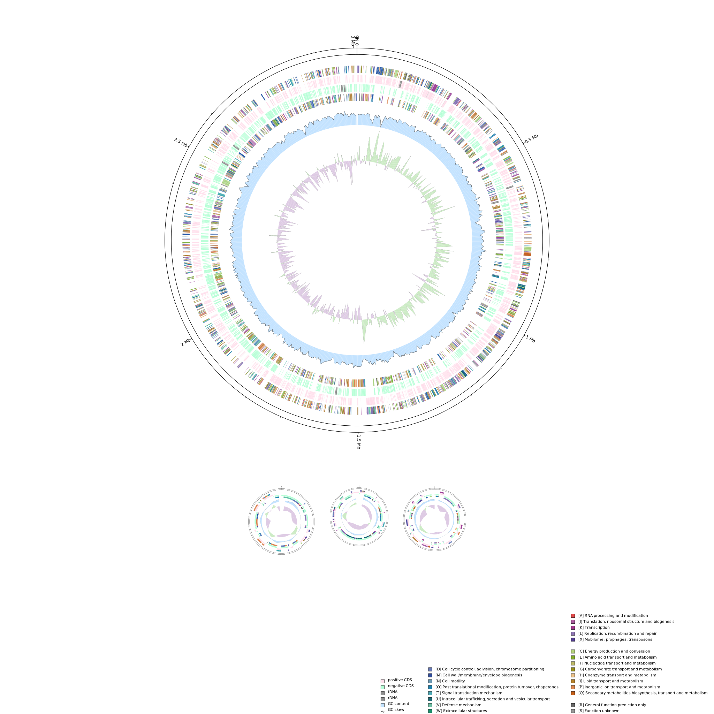

# GenoVi: Genome Visualizer Software

**GenoVi** is a visualization software tool for high quality circular representation of complete or draft genomes.
  
## Installation

GenoVi dependencies can be installed creating the following bioconda environment

```
conda create -n genovi python=3.7 deepnog circos 
```


 
## Dependencies
* [Circos](http://www.circos.ca/software/ "Circos")
* [DeepNOG](https://github.com/univieCUBE/deepnog "DeepNOG")
* Python 3.6.2 or later
* Perl
* NumPy 1.20.2
* Pandas 1.2.4 
* Biopython 1.79
* CairoSVG 2.5.2 

## Usage

Please type `GenoVi.py -h` for complete usage instructions. Anyway, here are a few examples:

```
python GenoVi.py -i input_test/Corynebacterium_alimapuense_VA37.gbk --color velvet --background black --cogs_unclassified
```

```
python GenoVi.py -i input_test/Acinetobacter_radioresistens_DD78.gbk --color pastel -c
```



## Output files 
| Extension| Description|
| :-------------: |-------------:|
| .svg     |Scalable vector graphic representing the genome.|
| .png     |Pixel-defined image representing the genome.|
| .faa     |Protein FASTA file obtained from input .gbk file|
| bands.kar      | Circos input file.|
| .txt | input files for Circos visualization|
| prediction_deepnog.csv | COG prediction using the COG 2020 database by DeepNOG.|


## Citation and License

GenoVi is under a BY-NC-SA Creative Commons License, Please cite.
Cumsille et al., 2021 

You may remix, tweak, and build upon this work even for commercial purposes, as long as you credit this work and license your new creations under the identical terms. 
