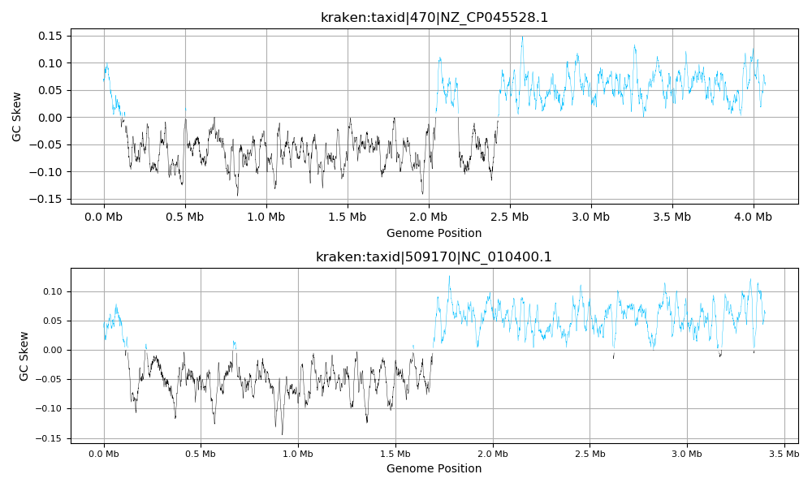

# SkewIT
SkewIT (Skew Index Test) is a tool for analyzing GC Skew in bacterial genomes. GC Skew is a phenomenon observed in many bacterial genomes wherein the two strands of the chromosome contain different proportions of guanine/cytosine nucleotides. SkewIT quantifies GC Skew using a single metric that can then be compared/analyzed across thousands of bacterial genomes.

More information about the method is detailed in the [SkewIT biorxiv preprint paper](https://www.biorxiv.org/content/10.1101/2020.02.27.968214v2) (published March 5, 2020). 

**IMPORTANT:** GC Skew/SkewIT is intended for use with only complete, fully contiguous, bacterial sequences with no gaps. Sequences should be fully assembled from end-to-end for the calculated SkewI to be informative. Contigs/Scaffolds are not expected to display GC Skew. 

--------------------------------------
## README Sections 
1. [Code Availability](#code-availability)
2. [Data Availability](#data-availability)
3. [SkewIT R Shiny App](#skewit-shiny-app)
4. [skewi.py](#skewipy)
5. [gcskew.py](#gcskewpy)
6. [plot\_gcskew.py](#plotgcskewpy)
---------------------------------------

## Code availability 
This repository contains three main python scripts (developed in python 2.7.5):
1. [skewi.py](#skewipy): calculates SkewI for each genome provided
2. [gcskew.py](#gcskewpy): calculates gc skew values across the whole genome for one single genome
3. [plot\_gcskew.py](#plotgcskewpy): plots gc skew for each genome provided in a single multi-FASTA file

Scripts are located in the `/src/` folder. While each script can be run using `python myscript.py`, users can make each script executable by running
 
    chmod +x skewi.py 
    ./skewi.py -h

**DEPENDENCIES:** SkewIT scripts require biopython to read FASTA sequences. 
For more information about installing biopython, see the [biopython website](https://biopython.org/wiki/Download)

`plot_gcskew.py` script requires matplotlib and numpy. Plots will be saved in png format.

## Data availability
In addition to the available code, we also provide SkewI values and thresholds for RefSeq release 97 in the `/data/` folder.
1. `RefSeq97_Bacteria_SkewI_incl.taxonomy.txt`: lists SkewI values for each complete bacterial genome along with their taxonomy 
2. `RefSeq97_Bacteria_GenusSkewIThresholds.txt`: lists each bacterial genus with the number of genomes, SkewI mean/standard deviation, and (for genera with >= 10 genomes) the SkewI threshold (2 standard deviations below mean). 

## SkewIT Shiny App
For ease of analysis, we have developed and provide a ShinyApp to visualize the SkewI distributions for the 15,067 bacterial genomes in RefSeq release 97: https://jenniferlu717.shinyapps.io/SkewIT/. This app provides users with the ability to
1. Visualize the SkewI distribution across all genomes
2. Visualize the SkewI distribution for any selected genus
3. Visualize the SkewI values as separated by species
4. Identify which genomes have SkewI values falling below the calculated SkewI threshold.
5. Plot GC skew values and calculate SkewI from a user-provided FASTA file. 
6. Plot GC skew values as produced by the [gcskew.py](#gcskewpy) program provided here.

---------------------------------------
## skewi.py
### 1. skewi.py Usage/Options
This program will calculate SkewI values for each genome provided. Running `python skewi.py --usage` will print a full usage message to the system standard out. 
Here, we describe how to run `skewi.py`, along with all related options and possibilities. 

    python skewi.py -i SEQ.FASTA

    Required parameters:
    *   -i SEQ.FASTA...............fasta/multi-fasta sequence file
   
    Optional parameters:
    *   -o SKEWI.TXT...............output file [if none is provided, the program will print to standard out]
    *   -k WINDOW SIZE.............size of window to assign a gc skew value [default: 20kb] 
    *   -f FREQUENCY...............number of bases between the start of each window [default: k == f, adjacent/non-overlapping windows]
    *   --min-seq-len LENGTH.......minimum sequence length required to analyze [default: 500kb]
    *   --complete/--all...........only analyze complete sequences/analyze complete and draft sequences [default: --complete]
    *   --plasmid/--no-plasmid.....include/exclude plasmid sequences [default: --no-plasmid]

### 2. skewi.py Input Files

Currently, input sequence files must be FASTA formatted and not zipped. Multi-fasta files are permitted. The program will calculate and print one SkewI value for each sequence provided. 

### 3. skewi.py Output Format

If an output file is provided, the program will generate a tab-delimited, 2-column output file with headers. The first column will contain the full sequence ID/description. The second column will contain the calculated SkewI value. 

If no output file is provided, the program will print these two columns to the system standard out. Users can pipe this output into a file of their choice by running:
        `python skewi.py -i MYSEQ.FASTA > MYOUTPUT.TXT`

### 4. skewi.py Window Length/Frequency Options (-k/-f/--min-seq-len)
    
By default, the program will calculate SkewI using non-overlapping/adjacent windows of size 20kb only for sequences with a minimum length of 500kb. 

If users choose to change the window size (`-k`), but do not specify a window frequency, the program will by default use non-overlapping/adjacent windows (`k == f`) 

1. For overlapping sequences, specify a frequency < window length:
        
    `python skewi.py -i MYSEQ.FASTA -k 20000 -f 10000`

2. For no minimum sequence length, specify `--min-seq-len 0`
    
    `python skewi.py -i MYSEQ.FASTA --min-seq-len 0`

3. For a smaller window size (and therefore more resolution):
        
    `python skewi.py -i MYSEQ.FASTA -k 10000` 
    
The window size `-k` must always be larger or equal to frequency `-f`. Both values must be greater than 0. 
    

### 5. skewi.py Complete Genome Options (--complete/--all)
As the program was designed to work with RefSeq output files, these two options are provided to allow users to specify whether complete or all genomes in the provided files should be analyzed.

Specifying `--complete` will require that "complete" is in the sequence header, while specifying `--all` will allow any sequence to be analyzed. 
    

### 6. skewi.py Plasmid Options (--plasmid/--no-plasmid)
This program was designed for analysis of bacterial chromosomes, not plasmids. We have not tested the performance of the program on plasmid sequences. Therefore, by default, the program will skip any sequence containing "plasmid" in the header. 

If users would like to analyze plasmid sequences in their input files, simply specify `--plasmid` during runtime. 

---------------------------------------
## gcskew.py
### 1. gcskew.py Usage/Options
This program will calculate GC Skew values for each genome provided. Running `python gcskew.py --usage` will print a full usage message to the system standard out. 
Here, we describe how to run `gcskew.py`. 

    python gcskew.py -i SEQ.FASTA

    Required parameters:
    *   -i SEQ.FASTA...............fasta/multi-fasta sequence file
   
    Optional parameters:
    *   -o SKEW.TXT................output file [if none is provided, the program will print to gcskew.txt (overwrites if exists)] 
    *   -k WINDOW SIZE.............size of window within which to calculate gc skew [default: 20kb] 
    *   -f FREQUENCY...............number of bases between the start of each window [default: k == f, adjacent/non-overlapping windows]

### 2. gcskew.py Input/Output Files

Currently, input sequence files must be FASTA formatted and not zipped. Multi-fasta files are permitted. 

The output file is a 3 column, tab-delimited file with the following columns: 
    1. sequence ID = allows users to sort out which GC Skew values belong to which sequences
    2. index = designates the start index of the window for which GC Skew is calculated
    3. GC Skew value = calculated by summing guanine (G) and cytosine (C) bases and calculating (G-C)/(G+C)

This output file can be loaded into the [SkewIT R Shiny App](#skewit-shiny-app) (https://jenniferlu717.shinyapps.io/SkewIT/.) for visualization. 

### 3. gcskew.py Window Length/Frequency Options (-k/-f)

These options are identical to those described above for the `skewi.py` script.   

---------------------------------------
## plot\_gcskew.py
### 1. plot\_gcskew.py Usage/Options
This program will PLOT GC Skew values for each genome provided. Running `python plot_gcskew.py --usage` will print a full usage message to the system standard out. 
Here, we describe how to run `plot_gcskew.py`. 

    python plot_gcskew.py -i SEQ.FASTA

    Required parameters:
    *   -i SEQ.FASTA...............fasta/multi-fasta sequence file
   
    Optional parameters:
    *   -o SKEW.PNG................output file [if none is provided, the program will produce curr.png (overwrites if exists)] 
    *   -k WINDOW SIZE.............size of window within which to calculate gc skew [default: 20kb] 
    *   -f FREQUENCY...............number of bases between the start of each window [default: k == f, adjacent/non-overlapping windows]

Options for this script are identical to those of other SkewIT programs provided.

### 2. plot\_gcskew.py Example Output
If a multi-FASTA file is given, one .png image is produced containing GC skew plots for each FASTA sequence. Ideally, do not provide a multi-FASTA file with more than 5 sequences. 

For a 2-genome multi-FASTA file, `plot_gcskew.py` will generate the following: 

# Author information
Updated: 2020/05/10

Jennifer Lu, jennifer.lu717@gmail.com 
