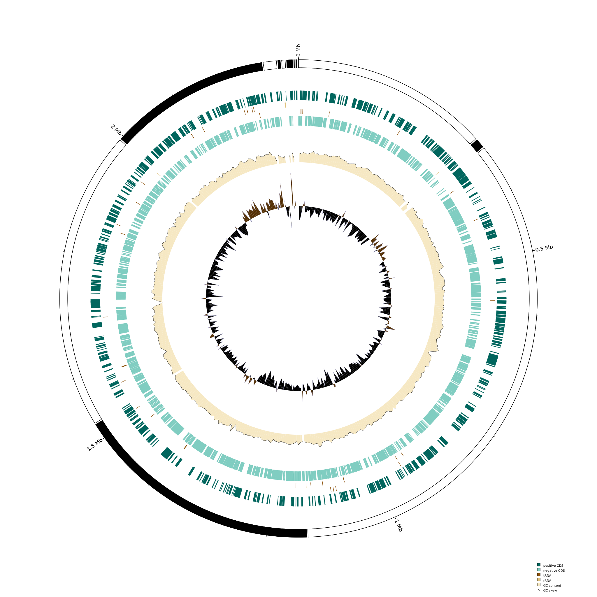
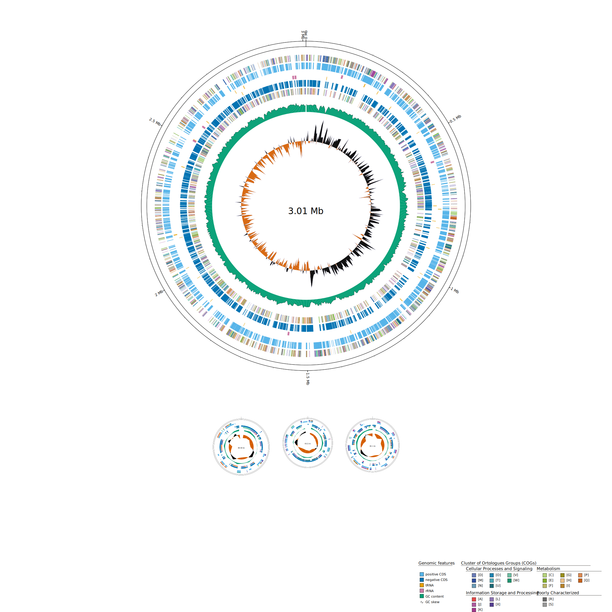

# <h1 align="center" id="heading">GenoVi: Genome Visualizer Software</h1>

## Description <a name="descr"></a>

**GenoVi**  generates circular genome representations for complete or draft bacterial and archaeal genomes. GenoVi pipeline combines several python scripts to automatically generate all needed files for Circos, including customizable options for color palettes, fonts, font format, background color and scaling options for complete genomes comprising more than one replicon. Optionally, GenoVi built-in workflow integrates DeepNOG to annotate COG categories using alignment-free methods with user-defined thresholds.


## Table of contents <a name="index"></a>
1. [Description](#descr)
2. [Index](#index)
3. [Requirements](#req)
4. [Installation](#inst)
5. [Usage](#usage)
6. [Tutorials](#tuts)
    1. [Draft genome basic tutorial](#tut1)
    2. [Complete genome tutorial](#tut2)
    3. [Other options](#tut3)
7. [Arguments](#args)
8. [Scripts](#scripts)
9. [Output](#outputfiles)
10. [Publication](#pub)
11. [Acknowledgements](#ack)
12. [Citation and License](#cit)

## Requirements <a name="req"></a>
* Circos 0.69-8
* Python 3.7 or later
* DeepNog 1.2.3
* NumPy 1.20.2
* Pandas 1.2.4
* Biopython 1.79
* CairoSVG 2.5.2
* Perl 5
* List::MoreUtils (Perl library)

## Installation <a name="inst"></a>

GenoVi dependencies can be installed in a python environment with a python version equal or higher than v.3.7.

```
conda create -n genovi python=3.7 circos
```
Activate the environment
```
conda activate genovi
```
GenoVi can then be installed using pip

```
pip install genovi
```
 
## Usage <a name="usage"></a>


```
genovi [-h] [options ..] -i input_file -s status
```

### Main arguments
* `-i`, `--input_file`. GenBank input file path.
* `-o`, `--output_file`.  Output file name. Default: circos.
* `-s`, `--status`. “complete” or “draft”. Complete genomes are drawn as separate circles for each contig/replicon.

### Information:
* `-h`, `--help`. Shows this help message and exit.
* `--version`. Shows the currently installed version of genovi.

### COGs:
* `-cu`, `--cogs`_unclassified. Do not classify each coding sequence into Clusters of Orthologous Groups of proteins (COGs).
* `-b`, `--deepnog`_confidence_threshold. DeepNOG confidence threshold range \[0,1\] Default: 0. If provided, predictions below the threshold are discarded.

### Format:
* `-a`, `--alignment`. When a `--status complete` is specified, this flag defines the alignment of each individual contig. Options: `center`, `top`, `bottom`, `A` (First on top), `<` (first to the left), `U` (Two on top, the rest below). By default this is defined by contig sizes.
* `--scale`. When using `--status complete`, whether to use a different scale format to ensure visibility. Options: `variable`, `linear`, `sqrt`. Default: `sqrt`.
* `-k`, `--keep_temporary_files`. Keep temporary files.
* `-w`, `--window`. Window size (base pair) to assign a GC analysis. Default: `5000`.
* `-v`, `--verbose`. Verbose or in console log messages activated.

### Text:
* `-c`, `--captions_not_included`.  Do not include captions in the figure.
* `-cp`, `--captions_position`. Captions position. Options: `left`, `right`, `auto`.
* `-t`, `--title`. Figure title.
* `--title_position`. Title position. Options: `center`, `top`, `bottom`.
* `--italic_words`. How many title words should be written in italic. Default: `2`.
* `--size`. Display genome size of each independent circular representation.

### Colors:
* `-cs`, `--color_scheme`. Prebuilt color scheme to use for CDS, RNAs and GC analysis. Options: `neutral`, `blue`, `purple`, `soil`, `grayscale`, `velvet`, `pastel`, `ocean`, `wood`, `beach`, `desert`, `ice`, `island`, `forest`, `toxic`, `fire`, `spring`.
* `-bc`, `--background`. Background color, in R, G, B format. Default: `transparent`.
* `-fc`, `--font_color`. Font color. Default: `black`.
* `-pc`, `--CDS_positive_color`. Color for positive CDSs, in R, G, B format. Default: `'180, 205, 222'`.
* `-nc`, `--CDS_negative_color`. Color for negative CDSs, in R, G, B format. Default: `'53, 176, 42'`.
* `-tc`, `--tRNA_color`. Color for tRNAs, in R, G, B format. Default: `'150, 5, 50'`.
* `-rc`, `--rRNA_color`. Color for rRNAs, in R, G, B format. Default: `'150, 150, 50'`.
* `-cc`, `--GC_content_color`. Color for GC content, in R, G, B format. Default: `'23, 0, 115'`.
* `-sc`, `--GC_skew_color`. Color scheme for positive and negative GC skew. A pair of RGB colors. Default: `'140, 150, 198 - 158, 188, 218'`.
* `-sl`, `--GC_skew_line_color`. Color for GC skew line. Default: `black`.

## Tutorial <a name="tuts"></a>

### Draft genome basic tutorial <a name="tut1"></a>

```
genovi -i input_test/Corynebacterium_alimapuense_VA37.gbk -s draft --cs beach --cogs_unclassified
```


This command will render a basic genome representation in png and svg formats, using the `beach` color scheme. All contigs from Corynebacterium alimapuense VA37’s genome are drawn in a single circle (default behaviour). From outside to inside are displayed the contigs length (black and white) shows each contig in a different tone: The first one in white, the second in black, and so on. Then, positive and negative strand coding sequences (CDSs), respectively. GC content, and finally, GC skew.

### Complete genome tutorial <a name="tut2"></a>
```
genovi -i input_test/Acinetobacter_radioresistens_DD78.gbff --cs ice -s complete --size
```


This command renders an image separating each scaffold as an independent chromosome or plasmid showing its size in the middle. Additional image files are generated for each chromosome or plasmid, as **1.png** and **1.svg**, **2.png** and **2.svg**, and so on.

Supplementary to described representations, the image includes two colored circumferences showing a DeepNOG COG classification of each CDS.

### Other options tutorial <a name="tut3"></a>
```
genovi -i input_test/Acinetobacter_radioresistens_DD78.gbff --cs fire --scale linear --alignment “<” -l -s complete
```


By default, circles are scaled using a square root scale, so small plasmids are still visible. If it is important to maintain a linear scale, you may specify it explicitly with `--scale linear`.
Circles order can be changed, putting them on a line or using more complex ordering like this one, where the chromosome is on the left side and plasmids are lined up on the right.
Caption is hidden when adding `-l`.

## Arguments <a name="args"></a>

### Input file <a name="input"></a>
`-i, --input_file`. This mandatory argument specifies the path of the annotated genome file to be drawn. Accepted files are GenBank file format (.gbk and .gbff).

### Status <a name="stat"></a>
`-s, --status`. Specify wether your genome is complete or draft. If `draft` is selected (default), then each contig is drawn in the same circular genome representation. If `complete` is selected, then GenoVi draws a different circle for each contig, generating several figures, one for each contig and a concatenated one. Below is shown Paraburkholderia Xenovorans’ genome drawn as both draft and complete genome.


### Help <a name="help"></a>
`-h`, `--help`. Displays help message.

### Version <a name="version"></a>
`--version`. Displays the current version of GenoVi.

### Output file <a name="version"></a>
`-o`, `--output_file`. Output file name. GenoVi generates the image in both vectorial (svg) and pixel (png) formats. This argument specifies the name of the image to create, and the directory name to include additional figures, if `--status complete` is defined. File extension should not be included as part of this argument.

### Cogs unclassified <a name="cogs"></a> 
`-cu`, `--cogs_unclassified`. By default, DeepNOG predicts Clusters of Orthologous Groups of proteins (COGs) of each coding sequence (CDS). Use this flag to specify you do not want CDSs to be classified into COGs. This will allow you to save time and run the program even if you don’t have DeepNOG installed in your machine.

### Deepnog threshold <a name="deepnog"></a>
`-b, --deepnog_confidence_threshold`. DeepNOG confidence threshold range \[0, 1\]. Predictions below the threshold are discarded. This is equivalent to DeepNOG's `infer -c/--confidence`_threshold argument.

### Alignment <a name="alig"></a> 
`-a`, `--alignment`. While drawing a complete genome, circular representation of each contig can be aligned in different ways. `A`: First contig above and the rest below on a horizontal line. `<`: First contig left and the rest right, on a vertical line. And `U`: First and second contig top and the rest below on a horizontal line.

### Scale <a name="scale"></a> 
`--scale`. While drawing a complete genome, each circular representation relative size can be determined in several ways. A linear scale makes circular representations proportional to the size of each contig. A variable scale place each circular representation in a rectangle indicating the scale. Default case is `sqrt`, a square root scale.

### Keep temporary files <a name="temp"></a> 
`-k`, `--keep_temporary_files`. Multiple files will be generated within the user’s project folder and by default will be deleted upon completion. Specifying this argument stops deletion of the files. Generated files are:
* **circos.conf:** Main CIRCOS configuration file.
* **conf/colors_fonts_patterns.conf:** Imports several files from the Circos distribution in order to define colors, fonts and fill patterns.
* **conf/highlight.conf:** Defines ideogram highlights.
* **conf/housekeeping.conf:** Defines system and debug parameters.
* **conf/image.conf:** Imports generic Circos image configuration and background.
* **conf/ticks.conf:** Defines tick mark formatting.
* **temp/_bands.kar:** Contains band annotation positions of contigs and their color.
* **temp/_CDS_neg.txt:** Defines band annotation positions of negative-sense-strand coding sequences.
* **temp/_CDS_pos.txt:** Defines band annotation positions of positive-sense-strand coding sequences.
* **temp/gbk_converted.fna:** nucleotide fasta file converted from the original gbk.
* **temp/GC_GC_content.wig:** GC content percentage on each base-pair window.
* **temp/GC_GC_skew.wig:** Measures strand asymmetry in the distribution of guanines and cytosines on each base-pair window.
* **temp/_rRNA_neg.txt:** Defines band annotation positions of negative-sense-strand ribosomal RNA sequences.
* **temp/_rRNA_pos.txt:** Defines band annotation positions of positive-sense-strand ribosomal RNA sequences.
* **temp/_tRNA_neg.txt:** Defines band annotation positions of negative-sense-strand transfer RNA sequences.
* **temp/_tRNA_pos.txt:** Defines band annotation positions of positive-sense-strand transfer RNA sequences.
* **temp/_prediction_deepnog.csv:** Generated only if COG prediction is enabled (default behaviour). Includes COG prediction and confidence for each coding sequence.
* **temp/_CDS_pos_X.txt:** Generated if COG prediction is enabled, one file for each COG category, being “X” the corresponding letter. Defines band annotation positions of positive-sense-strand coding sequences of “X” COG category.
* **temp/_CDS_neg_X.txt:** Generated if COG prediction is enabled, one file for each COG category, being “X” the corresponding letter. Defines band annotation positions of negative-sense-strand coding sequences of “X” COG category.

In the case of a complete genome, **tem** directory files will be generated for each contig and identified with the prefix **contig-X-**, with X being 1, 2, 3, etc.

### Window <a name="window"></a> 
`-w`, `--window`. Windows size For GC content and skew plotting. This indicates how many base pairs will be considered for the calculation.

### Verbose <a name="verbose"></a>
`-v`, `--verbose`. Displays additional information while executing GenoVi.

### Captions not included <a name="captions"></a>
`-c`, `--captions_not_included`. By default, generated images include a caption with COGs and other colors. Use this flag to stop the program from including this caption.

### Captions position <a name="captpos"></a>
`-cp`, `--captions_position`. Caption position. Options: `left`, `right` or `auto`. 

### Title <a name="title"></a>
`-t`, `--title`. Figures title, for example, which genome is being represented.

### Title position <a name="titlepos"></a>
`--title_position`. Title position in the figure. Options: `top`, `bottom`, or `center` of the image.

### Italic words <a name="ital"></a>
`--italic_words`. If required, a number of words of the title could be written in italic. As the title is intended for organism specification, default is `2`. For example, if the title is “Paraburkholderia xenovorans LB400”, then “Paraburkholderia xenovorans” would be in italics, but “LB400” would not.

### Size <a name="size"></a>
`--size`. To display the genome size (in base pairs) of each circular representation.

### Color scheme <a name="color"></a>
`-cs`, `--color_scheme`. Prebuilt color scheme to use. Available color schemes include: `neutral`, `blue`, `purple`, `soil`, `grayscale`, `velvet`, `pastel`, `ocean`, `wood`, `beach`, `desert`, `ice`, `island`, `forest`, `toxic`, `fire`, `spring`. Color of specific parts of the image can be modified individually, as `--background`, `--CDS_positive_color`, `--CDS_negative_color`, `--tRNA_color`, `--rRNA_color`, `--GC_content_color`, `--GC_skew_color`, and `--GC_skew_line_color`.


## Scripts <a name="scripts"></a>

### GenoVi.py
Main script. Uses custom arguments and calls the rest of the modules to generate the genome representations. Inputs and outputs are explained in the Arguments section.

### create_raw.py
Generates the .kar, CDS, rRNA, tRNA files for CIRCOS, and calls DeepNOG for predicting COGs.

Input:
* input file: GenBank file.
* output folder (`-o`/`--output_folder`): Path to the folder that will contain all raw files.
* CDS (`-cds`/`--cds`): CDS band files for CIRCOS will be created.
* tRNA (`-trna`/`--trna`): tRNA band files for CIRCOS will be created.
* rRNA (`-rrna`/`--rrna`): rRNA band files for CIRCOS will be created.
* COG categories (`-gc`/`--get_categories`): CDS COG categories will be predicted.
* Divided categories (`-d`/`--divided`): COG categories will be split in one file per category.
* Complete genome (`-c`/`--complete_genome`): Script will consider the input file to be a complete genome.

### createConf.py
Writes the following CIRCOS configuration files; **circos.conf**, **conf/highlight.conf**, **conf/colors_fonts_patterns.conf**, **conf/housekeeping.conf**, **conf/image.conf**, and **conf/ticks.conf**.

Input:
* Min GC content (`--content_min`/`--min_GC_content`): Minimum GC content. Default `0`.
* Mac GC content (`--content_max`/`--max_GC_content`): Maximum GC content. Default `100`.
* Min GC skew (`--skew_min`/`min_GC_skew`): Minimum GC skew. Default `-1`.
* Max GC skew (`--skew_max`/`--max_GC_skew`): Maximum GC skew. Default `1`.
* GC content color (`-cc`/`--GC_content_color`): GC content color. Default: `'23, 0, 115'`.
* GC skew color (`-sc`/`--GC_skew_color`)
* CDS positive color (`-pc`/`--CDS_positive_color`): Positive CDSs color.
* CDS negative color (`-pc`/`--CDS_negative_color`): Negative CDSs color.

### GC_analysis.py
Calculates GC percentage and GC skew of the genomic sequence, and writes them down to files.

Input:
* Input file (`-i`/`--input_file`): FASTA input file path.
* Window size (`-w`/`--window_size`): Number of base pairs where the GC percentage is calculated for.
* Shift increment (`-s`/`--shift`): Shift increment. By default it is `-1`.
* Output file (`-o`/`--output_file`): Output file path. Default matches input file path.
* Ignore trailing (`-ot`/`--omit_tail`): Trailing sequence will be omitted. Default retains leftover sequence.

### genbank2faa.py
Transforms GenBank flat files into protein fasta format files. The output has the same name as the original file.

### genbank2fna.py
Transforms GenBank flat files into nucleotide fasta format files. The output has the same name as the original file.

### mergeImages.py
Generates a .svg file with all scaled genome visualizations. 

Input: List of dictionaries that includes filenames and each image desired size. e.g.  \[\{"fileName": "img1.svg", "size": 30000\}, \{"fileName": "img2.svg", "size": 10000\}\].


### addText.py
Adds title and contig size to the visualization, and allows to modify the legend color.

### colors.py
Parses color schemes.

## Output <a name="outputfiles"></a>
Resulting images are saved as **\[name\].svg** and **\[name\].png** (name being specified with output_file argument or “circos”, by default). In case of a complete genome, individual contig image files are stored in a **\[name\]** subdirectory as **\[name\]-contig_\[i\].png** with i in \[1, the number of circles\]. 

## Publication <a name="pub"></a>
WIP

## Acknowledgments <a name="ack"></a>
WIP

## Citation and License

GenoVi is under a BY-NC-SA Creative Commons License, Please cite. Cumsille et al., 2022.
You may remix, tweak, and build upon this work even for commercial purposes, as long as you credit this work and license your new creations under identical terms. 
